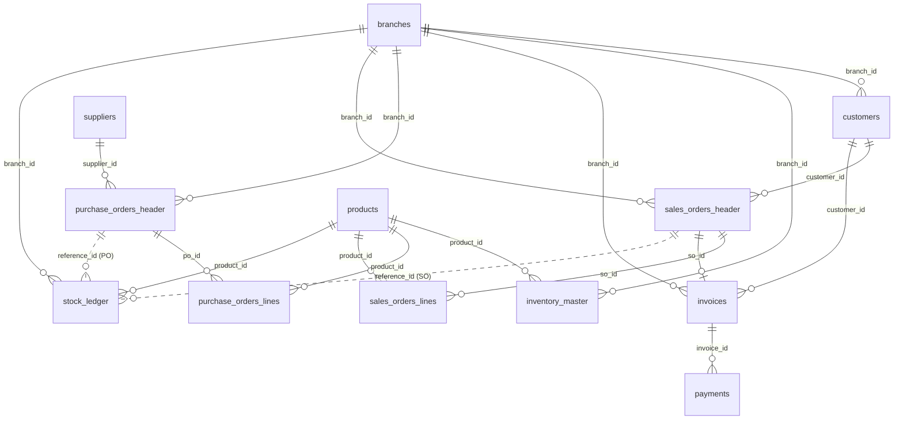

# Table Join Map

**Project:** Heavy Supplier & Warehouse Analytics
**Sprint:** Week 3
**Purpose:** Shows which of the 12 tables connect, through which columns, and the rules to follow when joining them. Every KPI joins tables as described here. Rules come from the Week 3 checks recorded in `data-cleaning-log.md`. The Week 1 ERD (https://dbdiagram.io/d/6aa7107436f9982564809e24) shows the same tables as a design diagram. Section 5 explains how this map compares with it.

**Verification:** every orphan count and key claim below was tested directly in Google Colab on the raw tables (notebook `Week3_ID_Uniqueness_Check`).

---

## 1. Diagram

How to read it: a solid line is a direct link. A dotted line is a link that depends on `reference_type`. "One to many" means one row in the first table connects to many rows in the second (for example, one customer has many orders).

---

## 2. All 18 links

| # | From (table.column) | To (table.column) | Relationship | Rows checked | Orphans |
|---|---|---|---|---|---|
| 1 | customers.branch_id | branches.branch_id | one branch, many customers | 500 | 0 |
| 2 | inventory_master.product_id | products.product_id | one product, many stock rows (one per branch) | 180 | 0 |
| 3 | inventory_master.branch_id | branches.branch_id | one branch, many stock rows (one per product) | 180 | 0 |
| 4 | invoices.so_id | sales_orders_header.so_id | one delivered order, one invoice | 18,033 | 0 |
| 5 | invoices.customer_id | customers.customer_id | one customer, many invoices | 18,033 | 0 |
| 6 | invoices.branch_id | branches.branch_id | one branch, many invoices | 18,033 | 0 |
| 7 | payments.invoice_id | invoices.invoice_id | one invoice, many payments | 19,257 | 0 (but see rule 1 below) |
| 8 | purchase_orders_header.supplier_id | suppliers.supplier_id | one supplier, many purchase orders | 24,000 | 0 |
| 9 | purchase_orders_header.branch_id | branches.branch_id | one branch, many purchase orders | 24,000 | 0 |
| 10 | purchase_orders_lines.po_id | purchase_orders_header.po_id | one purchase order, many lines | 155,495 | 0 |
| 11 | purchase_orders_lines.product_id | products.product_id | one product, many purchase lines | 155,495 | 0 |
| 12 | sales_orders_header.customer_id | customers.customer_id | one customer, many sales orders | 20,000 | 0 |
| 13 | sales_orders_header.branch_id | branches.branch_id | one branch, many sales orders | 20,000 | 0 |
| 14 | sales_orders_lines.so_id | sales_orders_header.so_id | one sales order, many lines | 130,402 | 0 |
| 15 | sales_orders_lines.product_id | products.product_id | one product, many sales lines | 130,402 | 0 |
| 16 | stock_ledger.product_id | products.product_id | one product, many movements | 237,230 | 0 |
| 17 | stock_ledger.branch_id | branches.branch_id | one branch, many movements | 237,230 | 0 |
| 18 | stock_ledger.reference_id | purchase_orders_header.po_id (when reference_type = PO) or sales_orders_header.so_id (when reference_type = SO) | one order, many movements | 237,230 | PO rows (127,611): 0. SO rows (107,165): 0. The 2,454 ADJ rows match no order, by design (see rule 4) |

Notes:
- Links 1 to 17 have no empty cells in the linking column.
- `inventory_master` has no single ID. A row is identified by `product_id` and `branch_id` together (180 rows = 30 products x 6 branches, no repeated pair). Join to it on both columns.
- The lines tables are identified by the order ID and `line_number` together. No pair is repeated in the sales lines (130,402 rows) or the purchase lines (155,495 rows).
- `branches.manager_id` has no manager table, so it is not a link.
- Invoices exist only for Delivered sales orders: 18,033 invoices and 18,033 Delivered orders. No `so_id` repeats in `invoices`, every Delivered order has an invoice, and no invoice belongs to an order that is not Delivered. The 1,967 Cancelled orders have no invoice.
- Branch and customer details agree across tables: each invoice has the same customer and branch as its sales order, each order has the same payment terms and branch as the customer record, and each stock movement is logged at the branch of its order (0 mismatches).

---

## 3. Join rules

**Rule 1: invoices to payments (duplicate IDs).**
Leave out the 393 invoice rows and 403 payment rows that share an ID with another row, before joining. Payments that point to an excluded invoice are also dropped (409 in KPI 4). Result in KPI 4: 18,445 clean merged rows. KPI 3 does not join, so it keeps all 18,033 invoices.

**Rule 2: order lines to order headers (cancelled orders).**
The lines tables keep the lines of Cancelled orders. Always join lines to the header and filter first: `order_status = Delivered` for sales, `po_status = Received` for purchases. The header also supplies the date, branch and customer or supplier.

**Rule 3: header totals repeat when joined to lines.**
A header has one total but many lines. After joining header to lines, the header total appears once per line, so do not add header totals up after the join. Add up line values, or add up header values before joining.

**Rule 4: stock ledger to orders (reference_id).**
Split by `reference_type`. Join PO rows to `purchase_orders_header.po_id` and SO rows to `sales_orders_header.so_id`. ADJ rows have no order and must not be joined to either. Rows tied to Cancelled orders are flagged, not removed (the data cannot show whether goods moved).

**Rule 5: comparing order lines with the ledger.**
The same product can appear on 2 or more lines of one order. To compare with the ledger, add up units per order and product first, then compare. About 10% of order lines never reached the ledger, so order lines are the complete source for demand and purchases.

**Rule 6: joining to inventory_master.**
Use `product_id` and `branch_id` together. Only `opening_stock` is used. `current_stock` is not used as an input.

**Rule 7: dates.**
Date columns are stored as text. Convert them to real dates before any date arithmetic.

**Rule 8: customer details.**
Use `customers` for customer details only (type, segment, branch). Do not use `customer_since`, `last_purchase_date` or `total_purchase_value`. Work these out from the orders and invoices.

---

## 4. Which KPI needs which join

| KPI | Tables joined | Rules |
|---|---|---|
| 1 Stock Accumulation Ratio | stock_ledger (add products for names) | 3 (ADJUSTMENT left out) |
| 2 Data Integrity Rate | invoices, payments (no join) | none |
| 3 Unpaid Invoice Rate | invoices (no join) | none |
| 4 Late Payment Rate | payments to invoices; branches for rate by branch | 1, 7 |
| 5 Product Sales Velocity | sales_orders_lines to sales_orders_header to products | 2, 3, 7 |
| 6 Dead Stock Identification | KPI 8 result; sales lines to header | 2, 7 |
| 7 ABC / Pareto Classification | sales_orders_lines to header to products | 2, 3 |
| 8 Reconstructed Stock Balance | stock_ledger; inventory_master; PO lines to header; sales lines to header | 2, 4, 5, 6 |
| 9 Inventory Turnover Rate | sales lines to header; KPI 8 result | 2, 6 |
| 10 Capital Tied Up in Excess Stock | KPI 8 result to products | none |
| 11 Warehouse Throughput | PO lines to header; sales lines to header; branches | 2, 3 |
| 12 Warehouse Space Utilisation | KPI 8 result to branches | warehouse_capacity text must be converted |
| 13 Supplier Lead Time and Reliability | purchase_orders_header to suppliers | 2, 7 |
| 14 RFM Segmentation | sales_orders_header (Delivered); invoices; customers | 2, 7, 8 |
| 15 Historical Customer Value | invoices to sales_orders_header; customers | 8 |
| 16 Customer Payment Risk | KPI 3, 4, 14, 15 results by customer_id | 1 |
| 17 Churn by Payment Behavior | KPI 4 and 14 results by customer_id | 1 |
| 18 Product Demand Forecast | sales lines to header | 2, 7 |
| 19 Stockout Risk / Reorder Point | KPI 8, 13, 18 results | none |
| 20 Inventory Movement Anomaly Detection | stock_ledger (add products, branches for names) | 4 |
| 21 Stock Shrinkage Rate | KPI 8 result; stock_ledger | 4, 5 |
| 22 Operational Risk Score | KPI 4, 6, 20, 21 results | none |

---

## 5. Comparison with the Week 1 ERD

The Week 1 ERD and this map show the same 12 tables and the same connections, with two differences:

1. **`stock_ledger.reference_id`:** the ERD draws it as two lines (one to purchase orders, one to sales orders). This map shows it as one link with a rule: split by `reference_type` (rule 4).
2. **`customers.branch_id`:** this column exists in `customers.csv` and links to `branches`, but the ERD does not draw it. The ERD shows a simplified customers table (including a `customer_name` column that is not in the real file). This map follows the real columns.

The ERD is kept as the Week 1 design record. This map is the working reference for the KPIs.
